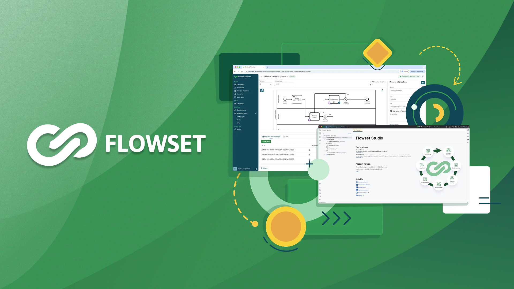

  

  # 🚀 Flowset

  ### Open Source Business Process Automation Platform for Passionate Software Engineers

  
  
  
  

---

## 💡 About Flowset

Flowset is a modern, developer-friendly platform that empowers software engineers to build, deploy, and manage enterprise-grade business process automation solutions. Designed with code-first approach, Flowset combines the flexibility of traditional development with the power of process automation.

## 🎯 Platform Components

### 🎛️ [Flowset Control](https://github.com/flowset/flowset-control-community)
Web application for maintaining and supporting process applications in a specialized admin environment without workflow interruptions.

**[Try Demo →](https://demo-control.flowset.io/login)**

### 💻 [Flowset Studio](https://plugins.jetbrains.com/plugin/25655-openbpm/)
Plugin for IntelliJ IDEA to develop enterprise-grade process applications with powerful development tools and workflow design capabilities.

**[Install Plugin →](https://plugins.jetbrains.com/plugin/25655-openbpm/)**

### ✅ [Flowset Tasklist](https://github.com/flowset/flowset-tasklist-react-community)
Intuitive web application enabling end-users to work efficiently with tasks and manage their workflows.

**[Explore Repository →](https://github.com/flowset/flowset-tasklist-react-community)**

## 🚀 Quick Start

Ready to get started? Follow our comprehensive guide:

**[📚 Getting Started Guide](https://docs.flowset.io/flowset/quick-start.html)**

## 📖 Resources

- **[📘 Documentation](https://docs.flowset.io/flowset/intro.html)** - Complete platform documentation
- **[🌐 Website](https://flowset.io/)** - Learn more about Flowset
- **[🧪 Demo Environment](https://demo-control.flowset.io/login)** - Try Flowset Control live
- **[💬 Slack Community](https://flowset-io.slack.com/)** - Discussions, support, and updates
- **[🐙 GitHub Organization](https://github.com/flowset)** - Explore all repositories

## 🤝 Get Involved

Join our growing community of developers building the future of business process automation!

- **Ask questions** and get support on [Slack](https://flowset-io.slack.com/)
- **Contribute** to our open source projects on [GitHub](https://github.com/flowset)
- **Share feedback** and feature requests
- **Star** our repositories to show your support

---

  **[Website](https://flowset.io/)** • **[Documentation](https://docs.flowset.io/flowset/intro.html)** • **[Demo](https://demo-control.flowset.io/login)** • **[Slack](https://flowset-io.slack.com/)** • **[GitHub](https://github.com/flowset)**

  Made with ❤️ by the Flowset Team

